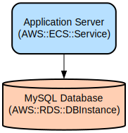

# Secure Node.js REST API with MySQL and Authentication

A modern Node.js REST API featuring robust authentication, rate limiting, and employee management capabilities. Built with TypeScript, Express.js, and MySQL, it provides enterprise-grade security through Arcjet protection and Better Auth integration.

This API implements a comprehensive authentication system with email/password login, session management, and protected routes. It includes employee management functionality with data validation using Zod schemas. The application is designed for high performance and security, featuring rate limiting (100 requests per 15 minutes), XSS protection, and other security measures through Arcjet integration.

## Repository Structure
```
.
├── src/                          # Source code directory
│   ├── config/                   # Configuration files
│   │   ├── better-auth.config.ts # Authentication configuration
│   │   └── index.ts             # General configuration exports
│   ├── controllers/             # Request handlers
│   │   ├── auth.controllers.ts  # Authentication logic
│   │   └── employee.controllers.ts # Employee management logic
│   ├── middleware/              # Express middleware
│   │   ├── arcjet.ts           # Rate limiting and security
│   │   ├── auth.middleware.ts   # Authentication middleware
│   │   └── validation.ts        # Request validation
│   ├── routes/                  # API routes
│   │   ├── auth.routes.ts      # Authentication endpoints
│   │   └── employee.routes.ts   # Employee management endpoints
│   ├── schemas/                 # Data validation schemas
│   │   └── employee.schema.ts   # Employee data validation
│   └── db.ts                    # Database connection configuration
├── railway.json                 # Railway deployment configuration
├── nixpacks.toml               # Nixpacks build configuration
└── tsconfig.json               # TypeScript configuration
```

## Usage Instructions
### Prerequisites
- Node.js v16 or higher
- MySQL 5.7 or higher
- Bun runtime
- Environment variables:
  - `DB_HOST`
  - `DB_USER`
  - `DB_PASSWORD`
  - `DB_DATABASE`
  - `DB_PORT`
  - `ARCJET_KEY`

### Installation

```bash
# Clone the repository
git clone <repository-url>
cd <repository-name>

# Install dependencies
bun install

# Set up environment variables
cp .env.example .env
# Edit .env with your configuration

# Set up database
mysql -u root -p < src/db/database.sql

# Start the development server
bun run dev
```

### Quick Start
1. Register a new user:
```bash
curl -X POST http://localhost:3000/api/auth/register \
  -H "Content-Type: application/json" \
  -d '{"email": "user@example.com", "password": "password123", "name": "John Doe"}'
```

2. Login:
```bash
curl -X POST http://localhost:3000/api/auth/login \
  -H "Content-Type: application/json" \
  -d '{"email": "user@example.com", "password": "password123"}'
```

3. Create an employee (requires authentication):
```bash
curl -X POST http://localhost:3000/api/employee \
  -H "Content-Type: application/json" \
  -H "Authorization: Bearer <your-token>" \
  -d '{"name": "Jane Smith", "salary": 50000}'
```

### Troubleshooting

Common Issues:

1. Database Connection Errors
```
Error: ER_ACCESS_DENIED_ERROR
```
- Verify database credentials in .env file
- Ensure MySQL service is running
- Check database user permissions

2. Rate Limiting Issues
```
Error: 429 Too Many Requests
```
- Wait for the rate limit window to reset (15 minutes)
- Check the `Retry-After` header for reset time

3. Authentication Errors
```
Error: 401 Unauthorized
```
- Verify token is included in Authorization header
- Check token expiration
- Ensure user session is valid

## Data Flow
The API follows a request-response cycle with middleware validation and authentication checks.

```ascii
Client -> Rate Limiting -> Auth Check -> Validation -> Controller -> Database -> Response
   ^                                                                              |
   |---------------- Error Handling / Response Formatting -------------------------|
```

Key Component Interactions:
- Requests first pass through Arcjet rate limiting and security checks
- Authentication middleware validates user sessions
- Request validation ensures data integrity using Zod schemas
- Controllers handle business logic and database operations
- Responses are formatted consistently with success/error status

## Infrastructure



Railway Deployment Configuration:
- Builder: NIXPACKS
- Build Command: `bun install`
- Start Command: `bun run start`
- Restart Policy: ON_FAILURE (max 10 retries)

Database Configuration:
- MySQL connection pool
- Configurable connection parameters via environment variables
- Session management with 7-day expiration

Security Infrastructure:
- Rate limiting: 100 requests per 15 minutes
- XSS protection through Arcjet shield
- Session-based authentication
- Request validation middleware

## Deployment

Prerequisites:
- Railway CLI installed
- Railway project configured
- Database credentials set in Railway environment

Deployment Steps:
```bash
# Login to Railway
railway login

# Link project
railway link

# Deploy
railway up
```

Environment Configuration:
1. Set required environment variables in Railway dashboard
2. Configure database connection details
3. Set ARCJET_KEY for security features

Monitoring:
- Access Railway dashboard for logs and metrics
- Monitor rate limiting through Arcjet dashboard
- Check application logs for error tracking